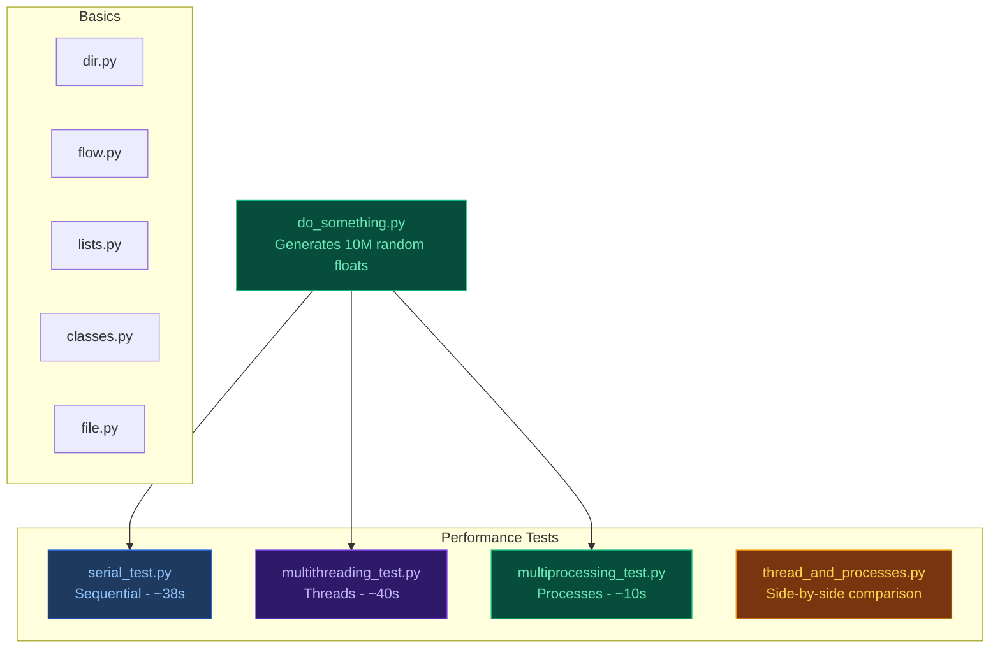
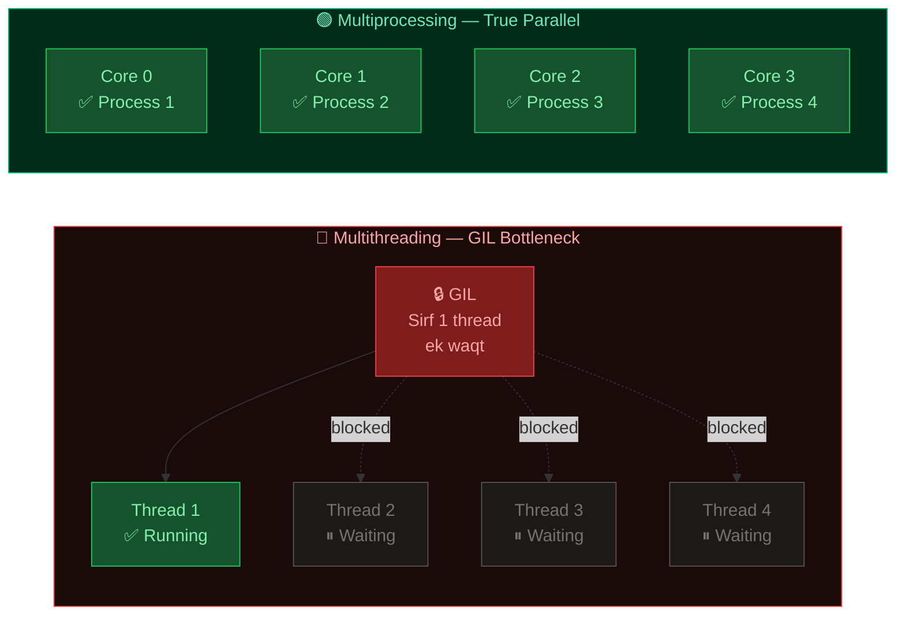
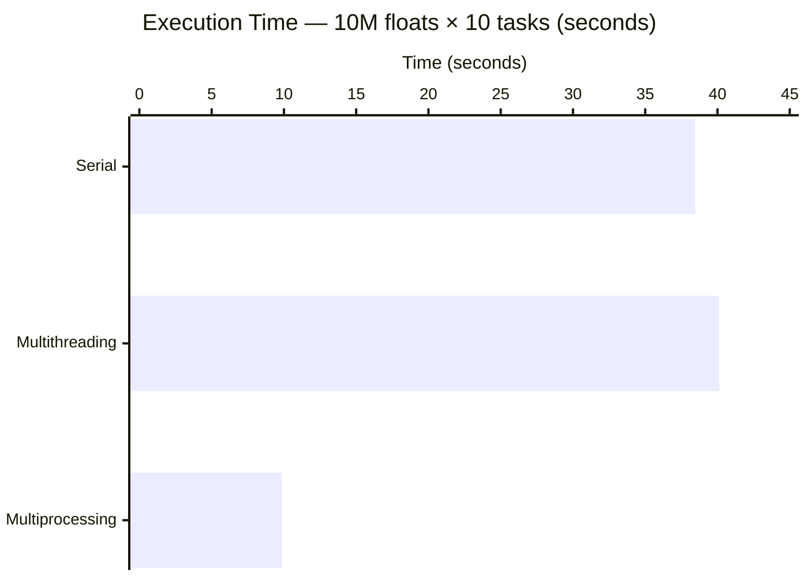
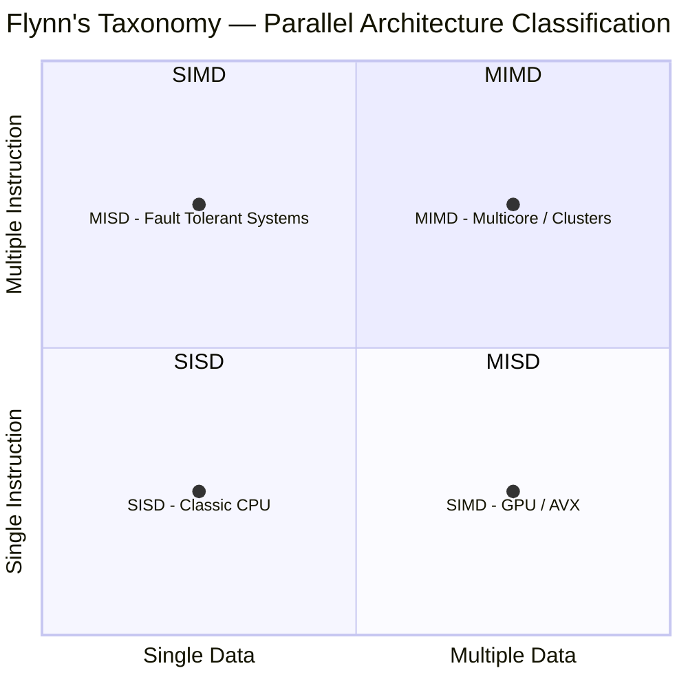
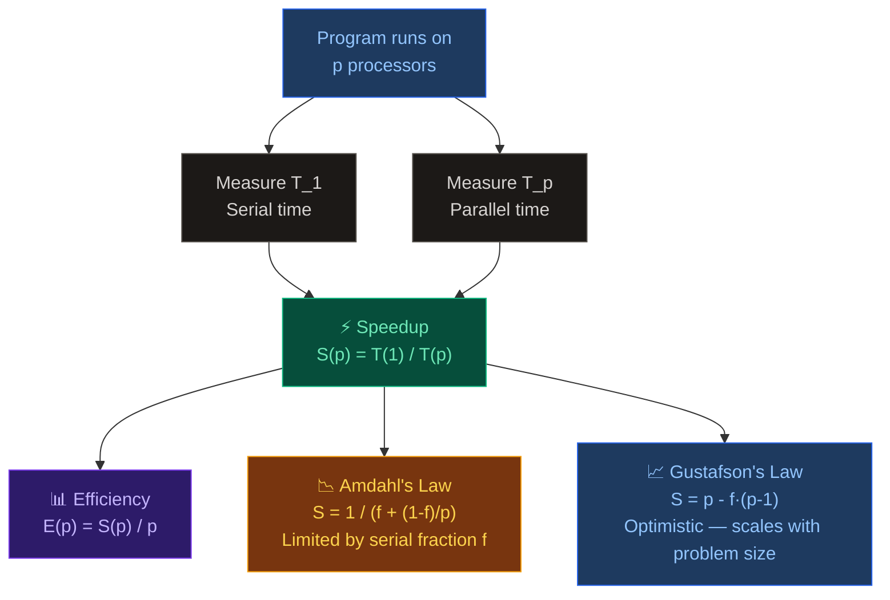
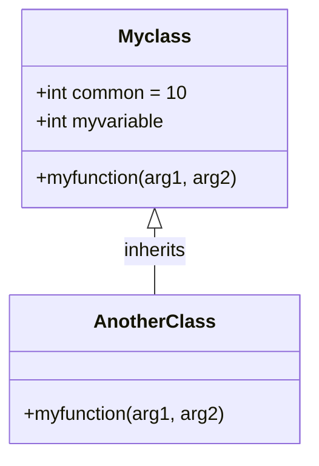

# Chapter 01 — Getting Started with Parallel Computing and Python

> Serial vs Threading vs Multiprocessing — a hands-on comparison exploring Python's GIL and true parallelism.

---

## 📁 Files Overview

| File | Concept | Description |
|------|---------|-------------|
| `dir.py` | Help & Flow | Checks if a number is positive/negative/zero; sums a list using a for loop |
| `flow.py` | Flow Control | Demonstrates `if/elif/else`, `for` loop, and `while` loop |
| `lists.py` | Data Types | Shows usage of lists, dictionaries, tuples, and function references |
| `classes.py` | OOP / Classes | Demonstrates class variables, instance variables, and inheritance |
| `do_something.py` | Functions | Helper function that generates random numbers into a list |
| `file.py` | File I/O | Writes and reads a text file using `open()` |
| `serial_test.py` | Serial Execution | Runs `do_something()` 10 times sequentially and measures time |
| `multithreading_test.py` | Multithreading | Runs `do_something()` across 10 threads and measures time |
| `multiprocessing_test.py` | Multiprocessing | Runs `do_something()` across 10 processes and measures time |
| `thread_and_processes.py` | Combined Comparison | Compares multithreading vs multiprocessing in a single script |

---

## 🗂️ File Dependency Map



---

## ⏱️ Execution Flow Comparison

```mermaid
gantt
    title Execution Timeline — 10 Tasks (CPU-bound)
    dateFormat  X
    axisFormat  t=%ss

    section 🔵 Serial
    Task 1          :s1, 0, 4
    Task 2          :s2, 4, 8
    Task 3          :s3, 8, 12
    Task 4          :s4, 12, 16
    Task 5          :s5, 16, 20
    Task 6          :s6, 20, 24
    Task 7          :s7, 24, 28
    Task 8          :s8, 28, 32
    Task 9          :s9, 32, 36
    Task 10         :s10, 36, 40

    section 🟣 Threading (GIL)
    Th-1 running    :t1, 0, 40
    Th-2 wait+run   :t2, 1, 40
    Th-3 wait+run   :t3, 2, 40

    section 🟢 Multiprocessing
    Process 1       :p1, 0, 10
    Process 2       :p2, 0, 10
    Process 3       :p3, 0, 10
    Process 4       :p4, 0, 10
```



> 🔵 **Serial** — ek kaam khatam, phir agla. Total ~38s  
> 🟣 **Threading** — sab threads chalte hain par GIL ki wajah se sirf ek hi execute hota hai. Total ~40s  
> 🟢 **Multiprocessing** — sab processes truly parallel chalte hain. Total ~10s

---

## 🔒 GIL (Global Interpreter Lock) — Kya hota hai?



| | Threading | Multiprocessing |
|---|---|---|
| GIL | ❌ Affected (bottleneck) | ✅ Bypassed |
| True Parallelism | ❌ No (CPU-bound) | ✅ Yes |
| Memory | Shared | Separate per process |
| Best For | I/O-bound tasks | CPU-bound tasks |

---

## 📊 Performance Benchmark



> ✅ **Multiprocessing is ~4× faster** than serial on a 4-core machine.  
> ⚠️ Multithreading is even **slower** than serial due to GIL switching overhead.

---

## 🧠 Flynn's Taxonomy



| Taxonomy | Full Name | Description | Example |
|----------|-----------|-------------|---------|
| **SISD** | Single Instruction, Single Data | Traditional serial — one CPU, one stream | Classic single-core CPU |
| **SIMD** | Single Instruction, Multiple Data | Same instruction on many data elements | GPU, SSE, AVX |
| **MISD** | Multiple Instruction, Single Data | Multiple instructions, same data — rare | Fault-tolerant systems |
| **MIMD** | Multiple Instruction, Multiple Data | Most common parallel model | Multicore CPUs, clusters |

---

## 📐 Performance Metrics



| Formula | Name | Meaning |
|---------|------|---------|
| `S(p) = T(1) / T(p)` | Speedup | Kitna fast hua parallel se? |
| `E(p) = S(p) / p` | Efficiency | Processors kitne efficiently use hue? |
| `S = 1 / (f + (1-f)/p)` | Amdahl's Law | Serial fraction `f` speedup ko limit karta hai |
| `S = p - f(p-1)` | Gustafson's Law | Problem size bade to parallel portion dominant hota hai |

---

## 🔄 Python Class Inheritance Flow



---

## 🗃️ File I/O Flow (`file.py`)


---

## ▶️ How to Run

```bash
# Basic Python concepts
python dir.py
python flow.py
python lists.py
python classes.py
python file.py

# Performance tests — do_something.py must be in same folder
python serial_test.py           # baseline benchmark   ~38s
python multithreading_test.py   # GIL demo             ~40s
python multiprocessing_test.py  # true parallelism     ~10s
python thread_and_processes.py  # side-by-side compare
```

> ⚠️ `serial_test.py`, `multithreading_test.py`, and `multiprocessing_test.py` — teeno files ke saath `do_something.py` **same folder** mein hona zaroori hai.

---

## 📋 Performance Summary

| Method | GIL Affected? | True Parallelism? | Best For | Time |
|--------|:---:|:---:|----------|------|
| Serial | — | ❌ | Baseline | ~38s |
| Multithreading | ❌ Yes | ❌ No | I/O-bound tasks | ~40s |
| Multiprocessing | ✅ No | ✅ Yes | CPU-bound tasks | ~10s |

> **Key Insight:** CPU-bound tasks (jaise millions of random numbers generate karna) ke liye multiprocessing best hai kyunki yeh Python ke GIL ko bypass karta hai alag processes use karke.
