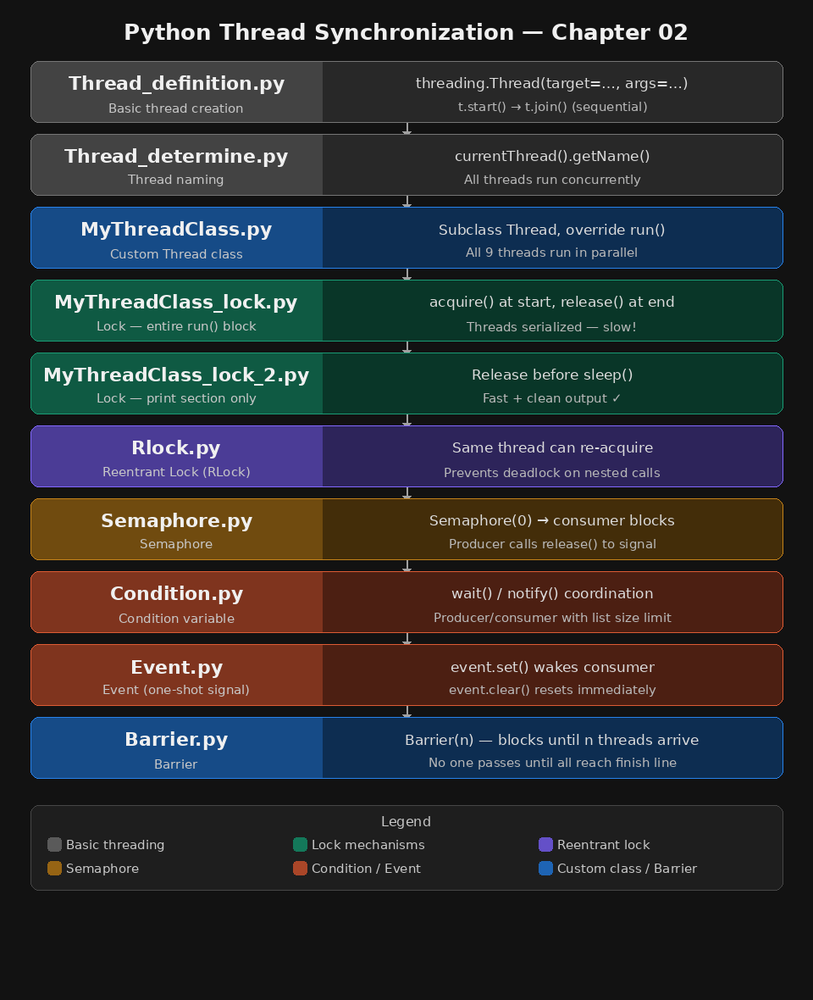

# Chapter 02 — Thread Synchronization in Python

This project demonstrates core thread synchronization mechanisms in Python using the built-in `threading` module. Each file is a self-contained example showing a different concept.

---



## Files Overview

| File | Concept | Description |
|------|---------|-------------|
| `Thread_definition.py` | Basic Thread Creation | Creates 10 threads sequentially using a target function |
| `Thread_determine.py` | Thread Naming | Creates named threads and tracks their start/exit |
| `MyThreadClass.py` | Thread Subclassing | Defines a custom Thread class with name and duration |
| `MyThreadClass_lock.py` | Lock (full block) | Uses a Lock to make threads run one at a time (serialized) |
| `MyThreadClass_lock_2.py` | Lock (print only) | Locks only the print section; sleep runs concurrently |
| `Rlock.py` | RLock (Reentrant Lock) | A Box class uses RLock to allow nested locking safely |
| `Semaphore.py` | Semaphore | Consumer waits on semaphore; producer releases it after producing |
| `Condition.py` | Condition | Producer/Consumer coordinate via `wait()` and `notify()` |
| `Event.py` | Event | Producer sets an event; consumer waits on it before consuming |
| `Barrier.py` | Barrier | Three runner threads must all reach the barrier before proceeding |

---


## 1. `Thread_definition.py` — Basic Thread Creation

### Description
Creates 10 threads, each calling `my_func()` with a thread number. Threads are started and immediately joined one by one (sequential behavior despite threading).

### Key Points
- Uses `threading.Thread(target=..., args=...)`
- `t.join()` is called right after `t.start()` — threads run one at a time here

### Sample Output
```
my_func called by thread N°0
my_func called by thread N°1
...
my_func called by thread N°9
```

---

## 2. `Thread_determine.py` — Named Threads

### Description
Three functions (`function_A`, `function_B`, `function_C`) each sleep for 2 seconds. Threads are named and run concurrently.

### Key Points
- Uses `threading.currentThread().getName()` to identify threads
- All three threads start together and finish around the same time (~2 seconds total)

### Sample Output
```
function_A --> starting
function_B --> starting
function_C --> starting
function_A --> exiting
function_B --> exiting
function_C --> exiting
```

---

## 3. `MyThreadClass.py` — Custom Thread Class

### Description
Defines `MyThreadClass` by subclassing `Thread`. Each thread sleeps for a random duration (1–10 seconds). All 9 threads run concurrently.

### Key Points
- Overrides `run()` method
- Shows process ID using `os.getpid()` — all threads share the same PID
- Total runtime ≈ longest thread's duration (parallel execution)

### Sample Output
```
---> Thread#1 running, belonging to process ID 12345
---> Thread#2 running, belonging to process ID 12345
...
---> Thread#3 over
End
--- 9.02 seconds ---
```

---

## 4. `MyThreadClass_lock.py` — Lock (Entire Run Block)

### Description
Same as `MyThreadClass.py` but wraps the **entire** `run()` method in a `threading.Lock()`. This forces threads to execute one at a time.

### Key Points
- `threadLock.acquire()` at start of `run()`, `threadLock.release()` at end
- Threads are serialized — no concurrency
- Total runtime ≈ sum of all sleep durations

### Difference from `MyThreadClass.py`
| Without Lock | With Lock |
|---|---|
| All threads run in parallel | Threads run one after another |
| Fast (~max duration) | Slow (~sum of durations) |

---

## 5. `MyThreadClass_lock_2.py` — Lock (Print Only)

### Description
Lock is acquired only around the **print statement**, then released before `sleep()`. This allows concurrent sleeping while keeping output clean.

### Key Points
- Lock released before `time.sleep()` — so sleep runs in parallel
- Only the print section is protected
- Best balance: clean output + fast execution

### Why this is better than `lock.py`
Locking the entire block (including sleep) wastes time. Releasing the lock before sleep lets other threads run while this one sleeps.

---

## 6. `Rlock.py` — Reentrant Lock

### Description
A `Box` class tracks items. `add()` and `remove()` both call `execute()` internally — each acquiring the same `RLock`. Two threads (adder and remover) modify the box concurrently.

### Key Points
- Uses `threading.RLock()` instead of `threading.Lock()`
- Same thread can acquire the lock multiple times without deadlocking
- `with self.lock:` used as a context manager (cleaner syntax)

### Why RLock?
With a normal `Lock`, calling `execute()` from inside `add()` (which already holds the lock) would cause a **deadlock**. RLock allows re-entry by the same thread.

### Sample Output
```
N° 15 items to ADD
N° 7 items to REMOVE
ADDED one item --> 14 items to ADD
REMOVED one item --> 6 items to REMOVE
...
```

---

## 7. `Semaphore.py` — Semaphore (Producer/Consumer)

### Description
A semaphore initialized to `0` blocks the consumer until the producer calls `release()`. Runs 10 producer-consumer pairs.

### Key Points
- `threading.Semaphore(0)` — consumer blocks immediately on `acquire()`
- Producer sleeps 3 seconds, generates a random item, then calls `semaphore.release()`
- Consumer wakes up and reads the item

### Sample Output
```
Consumer is waiting
Producer notify: item number 742
Consumer notify: item number 742
...
```

---

## 8. `Condition.py` — Condition Variable

### Description
A producer adds items to a list; a consumer removes them. A `Condition` object coordinates access — if the list is empty, consumer waits; if full (10 items), producer waits.

### Key Points
- Uses `threading.Condition()` with `wait()` and `notify()`
- `with condition:` ensures the lock is held during checks
- Producer runs every 0.5s; consumer runs every 2s

### Sample Output
```
Producer  INFO     total items 1
Producer  INFO     total items 2
Consumer  INFO     consumed 1 item
Producer  INFO     total items 2
...
```

---

## 9. `Event.py` — Event

### Description
Producer generates 5 random items and signals the consumer using `event.set()`. Consumer waits on `event.wait()` before popping an item.

### Key Points
- `threading.Event()` — simple one-shot signal mechanism
- `event.set()` wakes the consumer; `event.clear()` resets it immediately after
- Consumer loops indefinitely; producer runs 5 times then stops

### Sample Output
```
Producer notify: item 83 appended by Thread-1
Consumer notify: 83 popped by Thread-2
Producer notify: item 47 appended by Thread-1
Consumer notify: 47 popped by Thread-2
...
```

---

## 10. `Barrier.py` — Barrier

### Description
Three runner threads (Huey, Dewey, Louie) each sleep for a random time (2–5 seconds), then call `finish_line.wait()`. No runner "finishes" until all have reached the barrier.

### Key Points
- `threading.Barrier(n)` — blocks each thread until `n` threads have called `wait()`
- Simulates a race where all runners must reach the finish line before results are shown
- Uses `ctime()` to timestamp each arrival

### Sample Output
```
START RACE!!!!
Louie reached the barrier at: Thu Apr  2 12:00:02
Dewey reached the barrier at: Thu Apr  2 12:00:03
Huey reached the barrier at: Thu Apr  2 12:00:05
Race over!
```

---

## Synchronization Mechanisms — Summary

| Mechanism | Class | Blocks? | Use Case |
|-----------|-------|---------|----------|
| Lock | `threading.Lock` | Yes (one thread) | Protect shared resource |
| RLock | `threading.RLock` | Yes (reentrant) | Nested locking in same thread |
| Semaphore | `threading.Semaphore` | Yes (count-based) | Limit concurrent access |
| Condition | `threading.Condition` | Yes (until notify) | Producer/consumer coordination |
| Event | `threading.Event` | Yes (until set) | Simple signal between threads |
| Barrier | `threading.Barrier` | Yes (until all arrive) | Synchronize group of threads |

---

## How to Run

```bash
python Thread_definition.py
python Thread_determine.py
python MyThreadClass.py
python MyThreadClass_lock.py
python MyThreadClass_lock_2.py
python Rlock.py
python Semaphore.py
python Condition.py
python Event.py
python Barrier.py
```

> **Tip:** Run `MyThreadClass.py` and `MyThreadClass_lock.py` back to back and compare the total execution times to clearly see the impact of locking.