# Chapter 03 — Process Based Parallelism in Python

> Multiprocessing with Python's `multiprocessing` module — spawning, managing, communicating, and synchronizing OS-level processes for true parallel execution.

---

## 📁 Files Overview

```mermaid
flowchart LR
    subgraph SPAWN["🚀 Spawning Processes"]
        A[spawning_processes.py\nBasic process spawn]
        B[spawning_processes_namespace.py\nImport from external file]
        C[myFunc.py\nShared helper function]
        B --> C
    end
    subgraph MANAGE["⚙️ Managing Processes"]
        D[naming_processes.py\nNamed vs default process]
        E[process_in_subclass.py\nProcess subclassing]
        F[killing_processes.py\nTerminate a process]
        G[run_background_processes.py\nDaemon vs non-daemon]
        H[run_background_processes_no_daemons.py\nBoth non-daemon]
    end
    subgraph COMM["📡 Communication"]
        I[communicating_with_pipe.py\nPipe — two processes]
        J[communicating_with_queue.py\nQueue — producer consumer]
    end
    subgraph SYNC["🔒 Sync & Pool"]
        K[processes_barrier.py\nBarrier + Lock]
        L[process_pool.py\nPool.map — 4 workers]
    end
    SPAWN --> MANAGE --> COMM --> SYNC
```

| File | Concept | Description |
|------|---------|-------------|
| `spawning_processes.py` | Basic Spawning | Spawns 6 processes calling `myFunc` with index |
| `spawning_processes_namespace.py` | Namespace Import | Same as above but imports `myFunc` from external module |
| `myFunc.py` | Helper Function | Prints loop output — shared across spawn examples |
| `naming_processes.py` | Process Naming | Named vs auto-named process using `current_process().name` |
| `process_in_subclass.py` | Process Subclass | Defines `MyProcess` by subclassing `multiprocessing.Process` |
| `killing_processes.py` | Terminate Process | Shows full process lifecycle — start, terminate, join |
| `run_background_processes.py` | Daemon Process | One daemon + one non-daemon — daemon dies with parent |
| `run_background_processes_no_daemons.py` | No Daemon | Both processes non-daemon — both run to completion |
| `communicating_with_pipe.py` | Pipe | Two processes communicate via `multiprocessing.Pipe` |
| `communicating_with_queue.py` | Queue | Producer/Consumer using `multiprocessing.Queue` |
| `processes_barrier.py` | Barrier + Lock | 2 processes sync at barrier; 2 run freely |
| `process_pool.py` | Process Pool | `Pool.map()` squares 0–99 using 4 worker processes |

---

##  Why Multiprocessing?


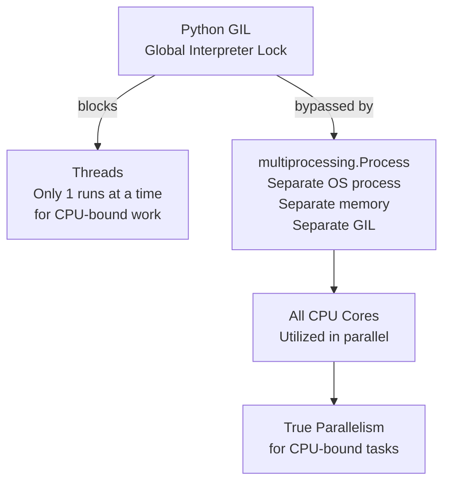

---

## 1. `spawning_processes.py` — Basic Process Spawn

Spawns 6 processes, each calling `myFunc(i)`. Each process prints its own loop output.

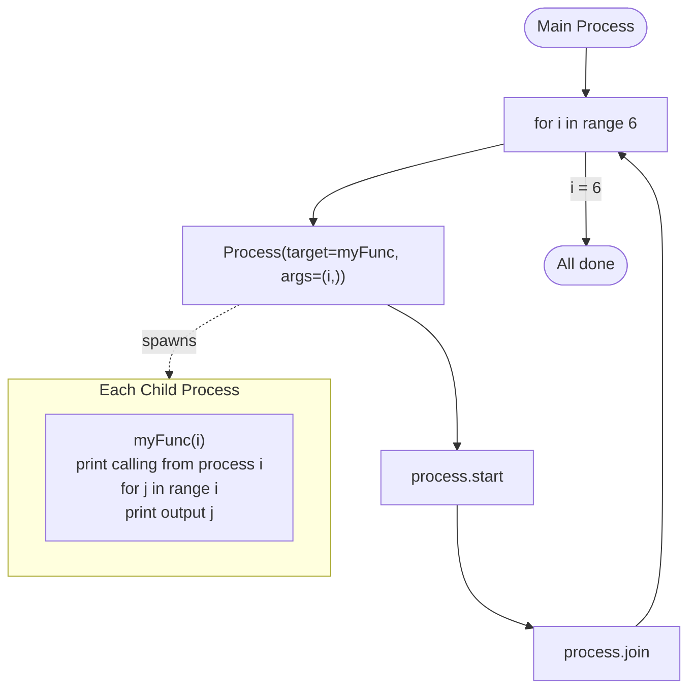

**Sample Output:**
```
calling myFunc from process n°: 0
calling myFunc from process n°: 1
output from myFunc is: 0
calling myFunc from process n°: 2
output from myFunc is: 0
output from myFunc is: 1
...
```

---

## 2. `spawning_processes_namespace.py` + `myFunc.py` — External Module

Same spawn logic but `myFunc` is imported from a separate file — demonstrates clean namespace separation.

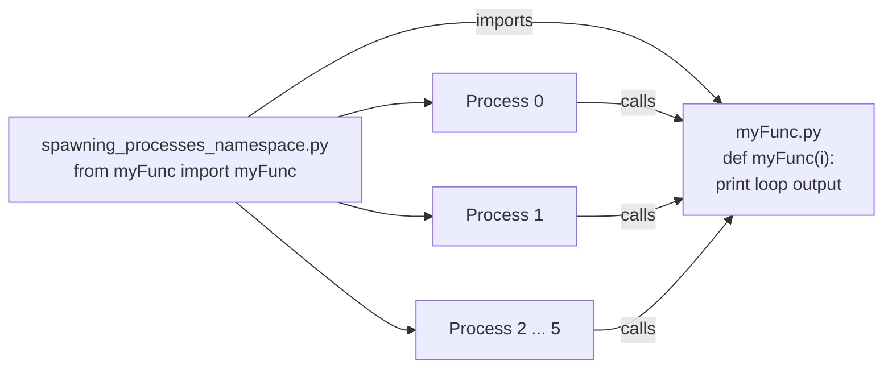

> **Key Point:** Importing from a separate module keeps code reusable across multiple scripts without copy-pasting logic.

---

## 3. `naming_processes.py` — Named vs Default Process

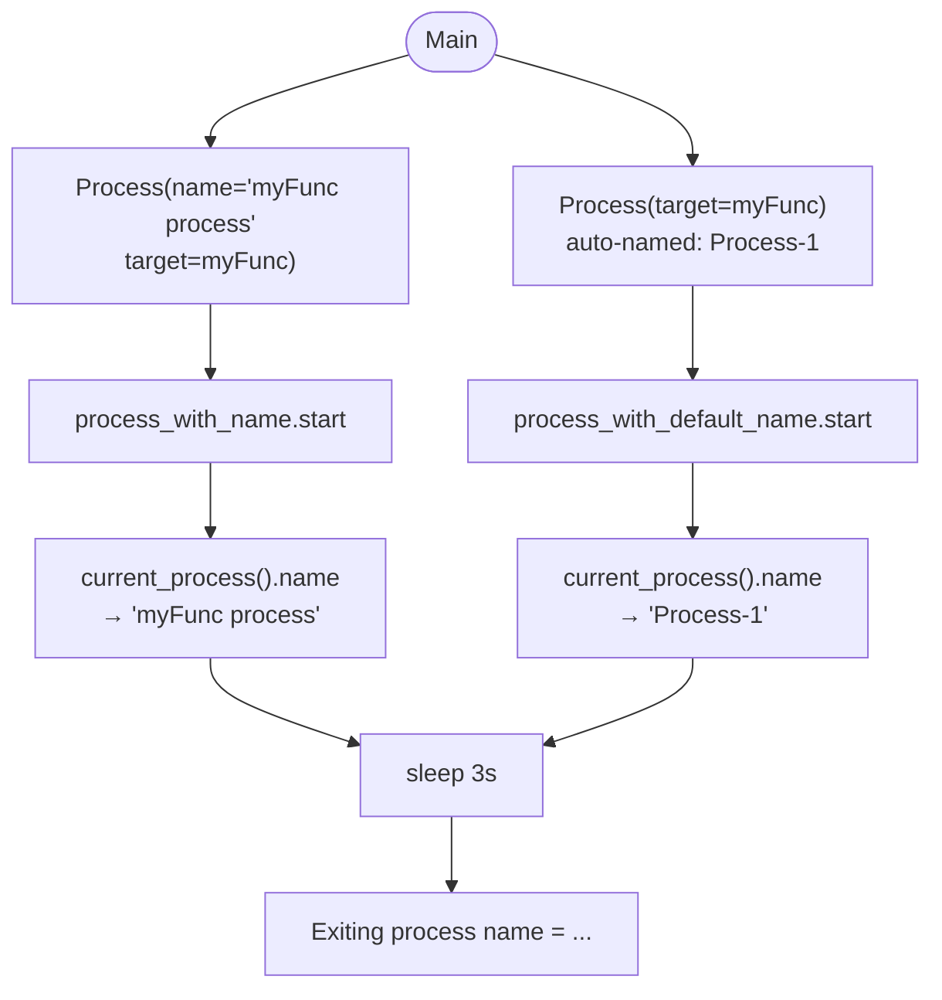

**Sample Output:**
```
Starting process name = myFunc process
Starting process name = Process-1
Exiting process name = myFunc process
Exiting process name = Process-1
```

---

## 4. `process_in_subclass.py` — Subclassing Process

Defines a custom `MyProcess` class by subclassing `multiprocessing.Process` and overriding `run()`.

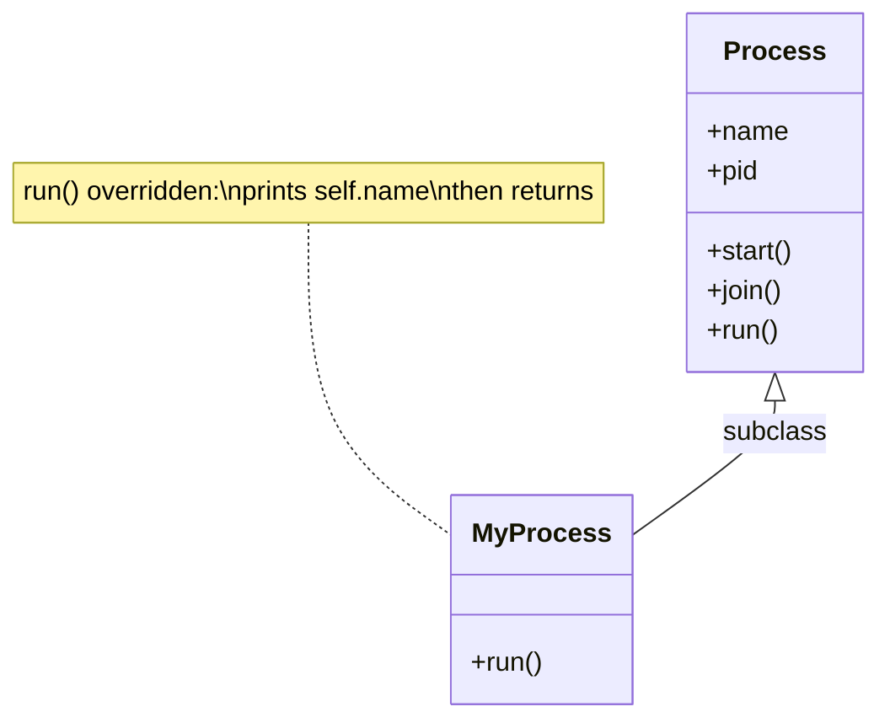

**Sample Output:**
```
called run method in MyProcess-1
called run method in MyProcess-2
...
called run method in MyProcess-10
```

---

## 5. `killing_processes.py` — Process Lifecycle + Terminate

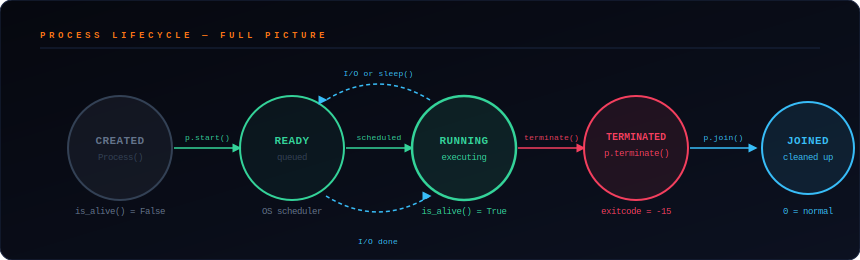

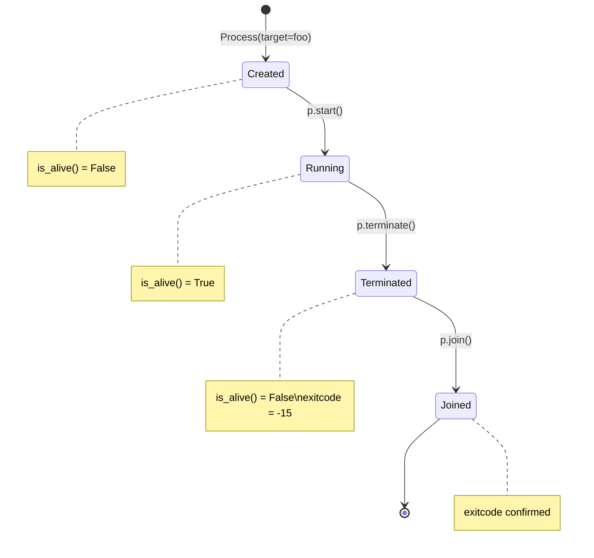

**Sample Output:**
```
Process before execution: <Process ...> False
Process running:          <Process ...> True
Process terminated:       <Process ...> False
Process joined:           <Process ...> False
Process exit code: -15
```

> **Exit code `-15`** means the process was killed by `SIGTERM` signal via `p.terminate()`.

---

## 6. `run_background_processes.py` — Daemon vs Non-Daemon

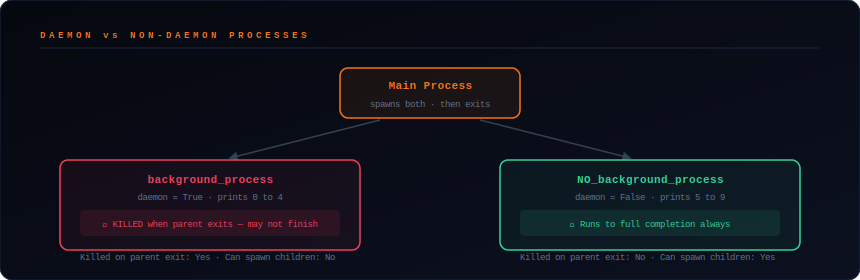

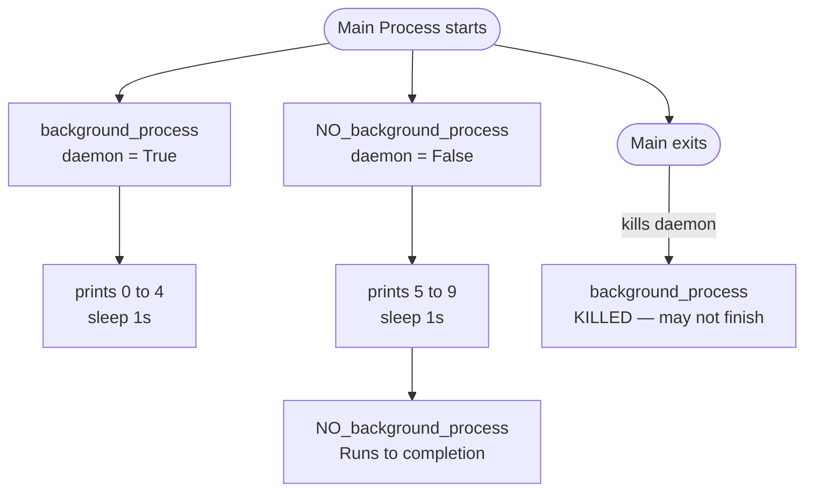

| | `daemon=True` | `daemon=False` |
|---|---|---|
| Killed when parent exits? | Yes | No |
| Can spawn child processes? | No | Yes |
| Use case | Background helper tasks | Independent worker processes |

---

## 7. `run_background_processes_no_daemons.py` — Both Non-Daemon

Identical to above but **both** processes have `daemon=False` — both run to full completion regardless of parent.

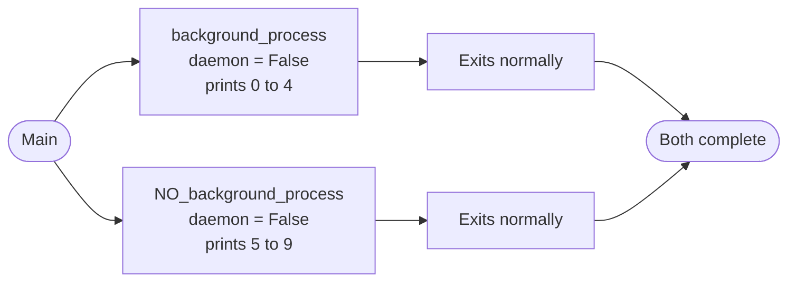

---

## 8. `communicating_with_pipe.py` — Pipe Communication

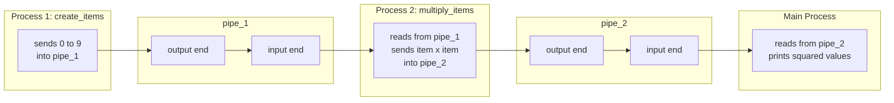

**Sample Output:**
```
0  1  4  9  16  25  36  49  64  81  End
```

> `EOFError` is caught to detect when the pipe is closed — clean way to signal end of stream.

---

## 9. `communicating_with_queue.py` — Queue (Producer/Consumer)

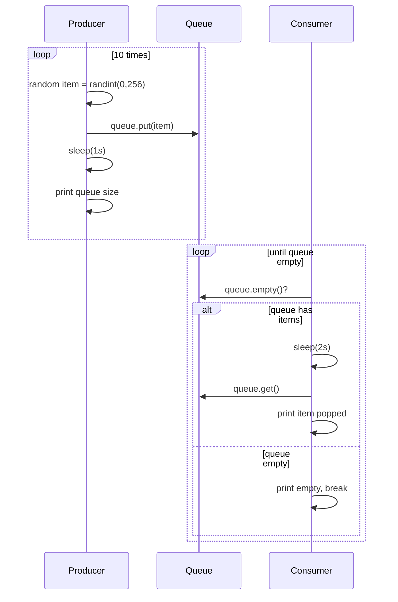

**Sample Output:**
```
Process Producer : item 173 appended to queue producer-1
The size of queue is 1
Process Consumer : item 173 popped from by consumer-1
...
the queue is empty
```

---

## 10. `processes_barrier.py` — Barrier + Lock

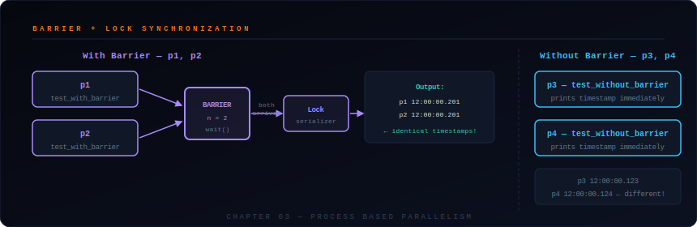

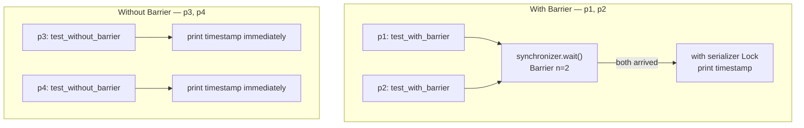

**Sample Output:**
```
process p3 - test_without_barrier ----> 2024-04-02 12:00:00.123
process p4 - test_without_barrier ----> 2024-04-02 12:00:00.124
process p1 - test_with_barrier    ----> 2024-04-02 12:00:00.201
process p2 - test_with_barrier    ----> 2024-04-02 12:00:00.201
```

> p1 and p2 print **identical timestamps** — held at barrier until both arrived, then released together.

---

## 11. `process_pool.py` — Process Pool


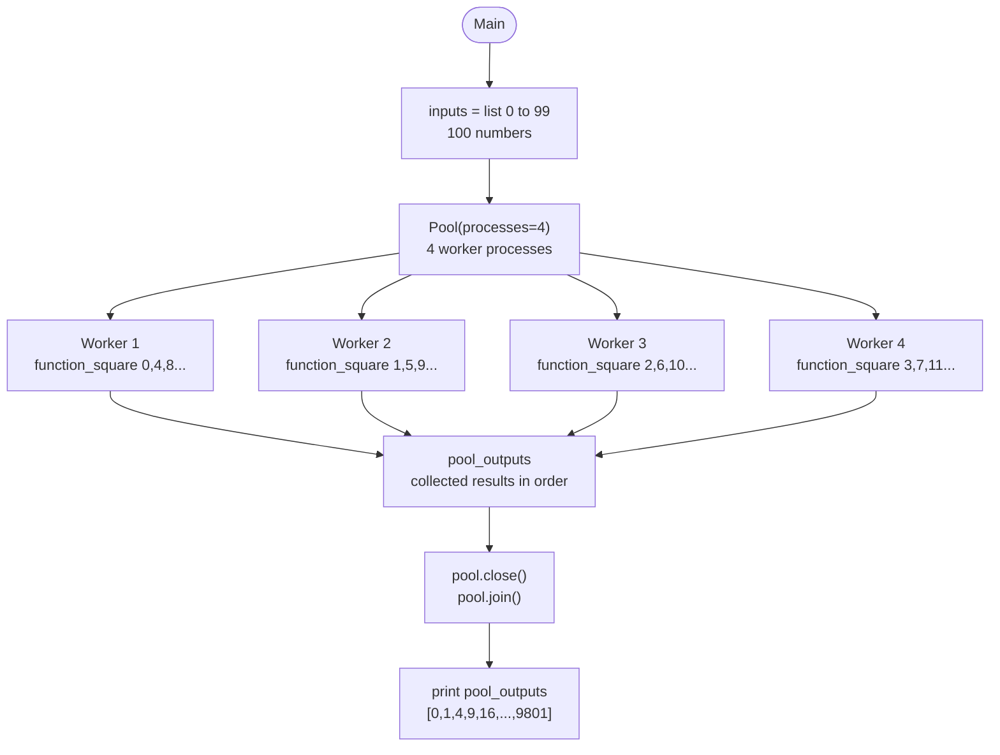

**Sample Output:**
```
Pool: [0, 1, 4, 9, 16, 25, 36, 49, 64, 81, ..., 9801]
```

---

## 📡 Communication Methods — Pipe vs Queue

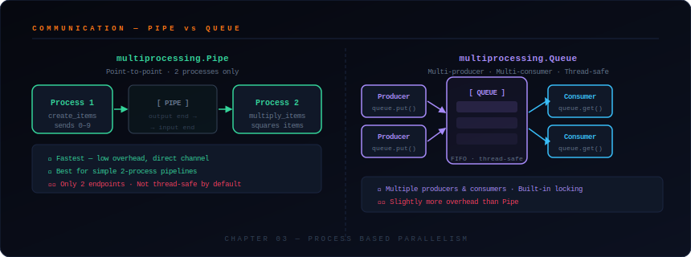

| | `Pipe` | `Queue` |
|---|---|---|
| Processes supported | 2 only | Many |
| Thread-safe? | No (by default) | Yes |
| Speed | Faster | Slightly slower |
| Use case | Simple pipeline | Multi-producer/consumer |

---

## 🔄 Process Lifecycle — Full Picture


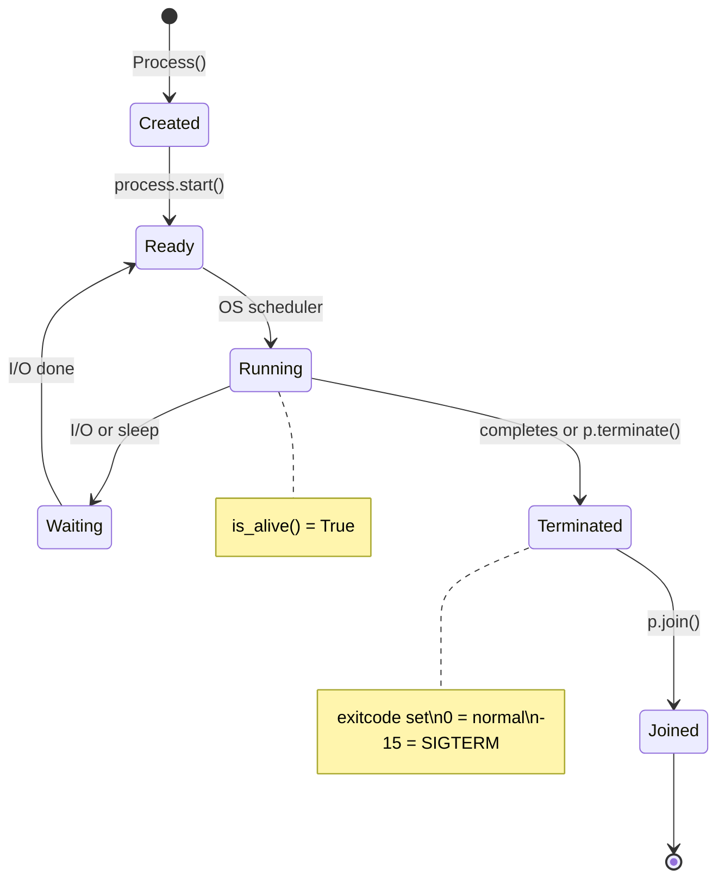

---

## 📋 Quick Reference — Which Tool to Use?

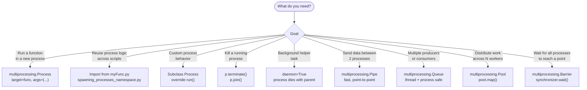

---

## ▶ How to Run

```bash
# Spawning
python spawning_processes.py
python spawning_processes_namespace.py   # requires myFunc.py in same folder

# Managing
python naming_processes.py
python process_in_subclass.py
python killing_processes.py
python run_background_processes.py
python run_background_processes_no_daemons.py

# Communication
python communicating_with_pipe.py
python communicating_with_queue.py

# Sync & Pool
python processes_barrier.py
python process_pool.py
```

> ⚠️ `spawning_processes_namespace.py` requires `myFunc.py` to be in the **same folder**.
>
> 💡 **Tip:** Run `run_background_processes.py` and `run_background_processes_no_daemons.py` back to back to clearly see the daemon difference.